# AAD B2C Deep Learning Campus - Day 2

Guide for B2C Deep Learning Campus (Day 2) lab guide.

## Preparation
### Software required
1. Install [Git](https://git-scm.com/downloads). 
2. Install [GitHub Desktop](https://desktop.github.com/).
3. Install [Visual Studio Code](https://code.visualstudio.com/Download).


### App Registration Preparation
1. Create your own app registration in Entra ID
2. Navigate to [Azure Portal](https://portal.azure.com) -> Log into your B2C tenant -> Azure AD B2C -> App Registrations -> New Registration
3. Give it a proper name. Select "Account in this organizational directory only". Create.
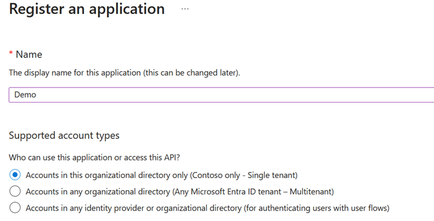
4. Once app is created, note down the **Application Id** and **Tenant Id**.
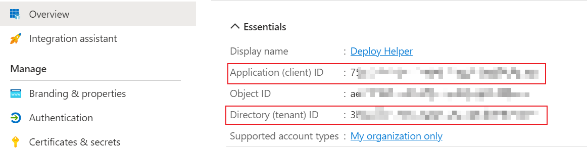
5. Head to "Certificate & Secret", create a new secret. Make sure you note down the secret **VALUE** (Not ID), **secret will disappear if you go to other blades.**
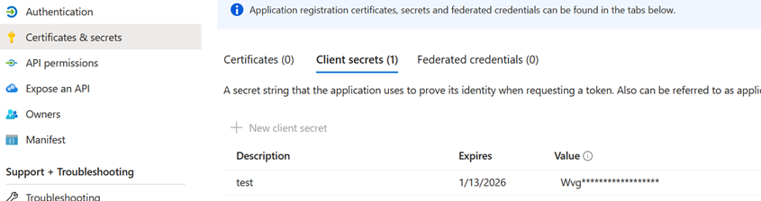
6. Head to "API Permissions", grant MS Graph **Application Permission** "Policy.ReadWrite.TrustFramework". Make sure to grant admin consent to this permission.
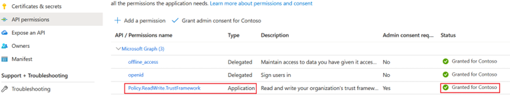

## Lab
1. Download this repo as `.zip`\
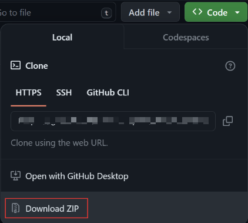
2. Open Github Desktop. Create new repo and give it a proper name. (Note down the path to your repo)
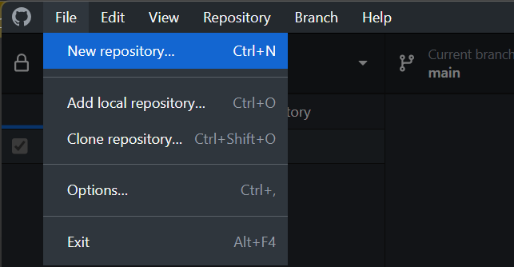
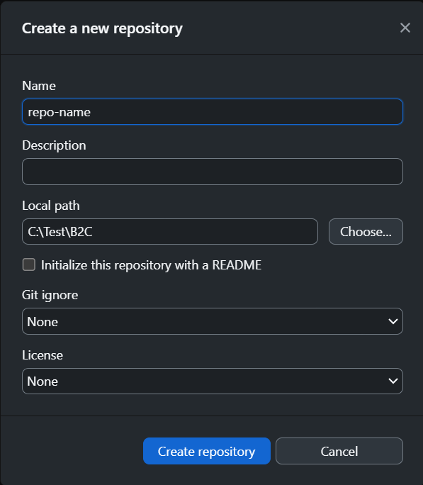
3. Extract everything from the `.zip` file downloaded in #1. Copy everything into the path of your repo.
4. Open VSCode. Open folder, select your repo created in #2. Once opened, the structure should look like something below. 
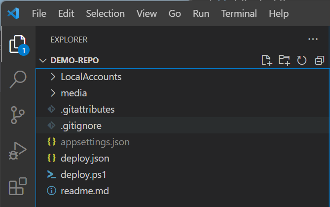
5. Create a file called `appsettings.json`, copy paste below code into this json file. Then fill out the code using the application id, tenant id and secrete from previous section.
```json
{
    "client_id": "<app reg's application id>",
    "client_sec": "<app reg's secret>",
    "tenant_id": "<your tennat id>"
}
```
6. Once all the files are added, go to Github Desktop. Note there are tons of changes, add commit `Add files.`
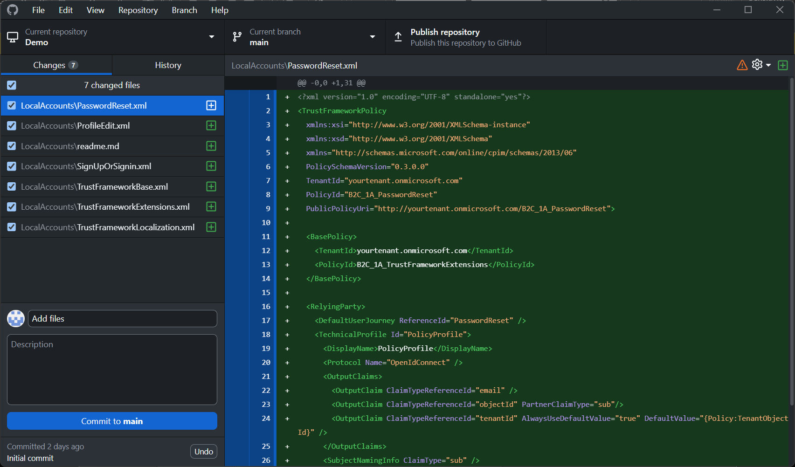
6. Follow [Create Custom Policy Tutorial](https://learn.microsoft.com/en-us/azure/active-directory-b2c/tutorial-create-user-flows?pivots=b2c-custom-policy) to complete setting everything up for your tenant. (**Note that this repo is only for local accounts, do not follow FaceBook setup. You do not have to upload policies as of now.**)
7. Once finished changing the code, launch terminal from VSCode.
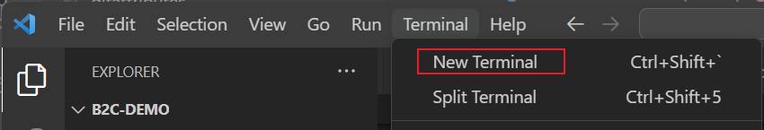
8. Make sure you are at the right path. Then run `.\deploy.ps1` to help you upload the custom policy. (**Successful upload looks like below**)
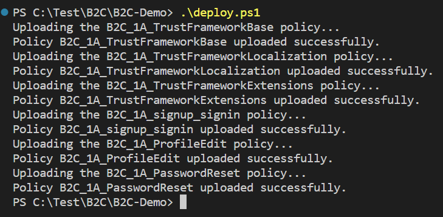
9. Once succesful, go to Github Desktop, note that you are still on the `main` branch and there are changes made to the files, similar to below. **Commit the changes**.

10. Now you have everything ready as the fundation. Let's add TOTP feature to this.
11. Create a branch, name it properly. For example `totp-branch`
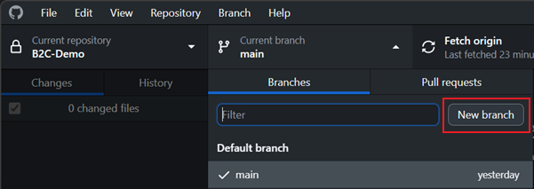
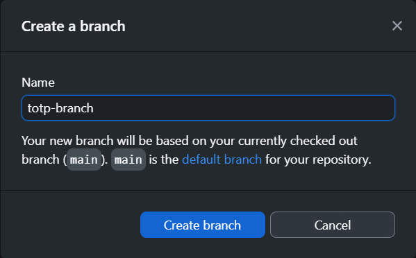
12. Once created, pay extra attention on the branch you are currently on. **If you are still on `main` branch, change it to the `totp-branch`**
13. Follow [B2C MFA with TOTP](https://github.com/azure-ad-b2c/samples/tree/master/policies/totp) to add TOTP support for your loacl account cutom policy.
14. Once everything is configured, run `.\deploy.ps1` to help you upload the custom policy. **Test and make sure the configured policy works as expected.**
15. **Commit** to `totp-branch`. This is indication of completing the development of the feature.
15. At this stage, you have two branches `main` and `totp-branch`. If you would like to upload the basic local account custom policies, switch to `main` and run `.\deploy.ps1`. If you would like to upload local account with TOTP MFA, switch to `totp-branch` and run `.\deploy.ps1`.
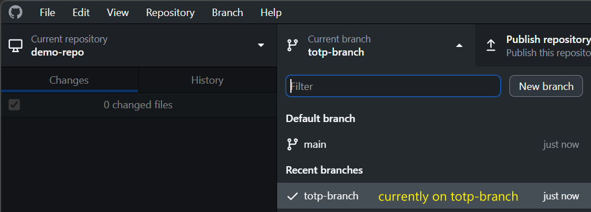
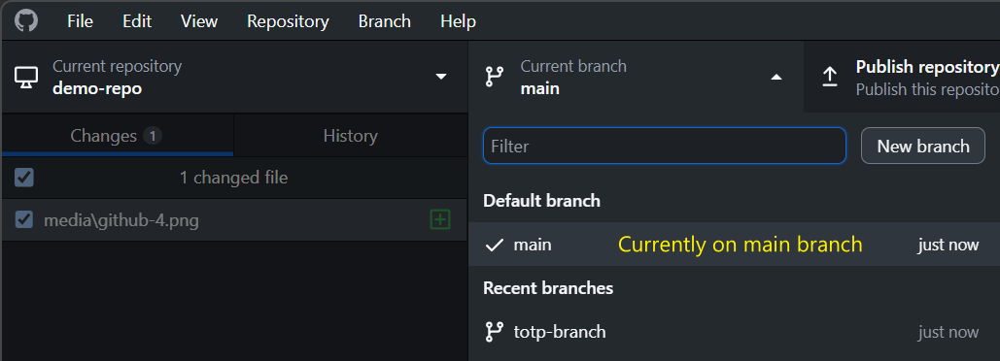

## Misc.
1. `deploy.json` defines where your policy files are stored and in what order files need to be uploaded by `deploy.ps1`
2. `appsettings.json` file is `.gitignore`'d, just in case you'd like to upload the repo to cloud.
3. If you would like to develop/test anything based on the fundation branch `main` or feature branch `TOTP branch`, just switch to respective branch accrodingly and start from there. Note that when you switch branch, your files in this repo changes.
